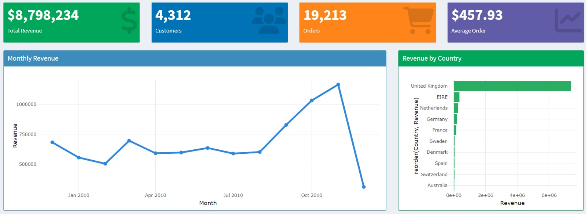
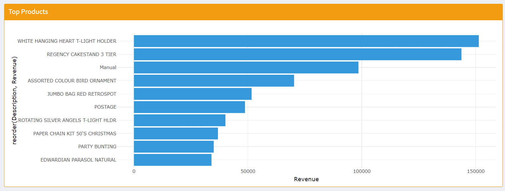
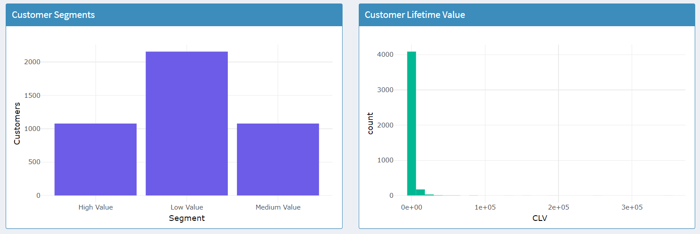
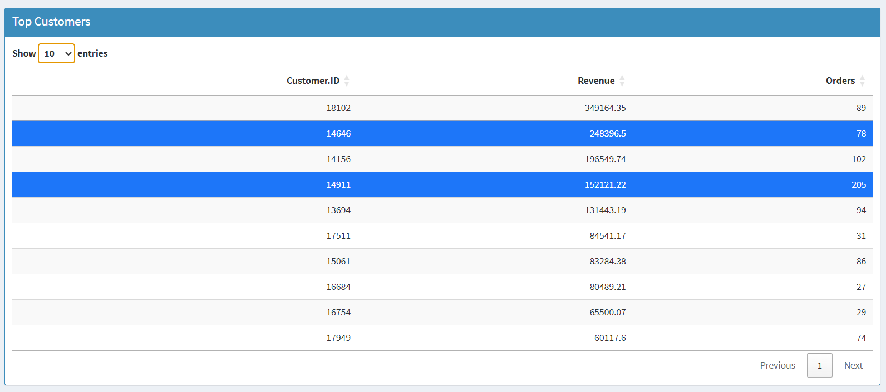
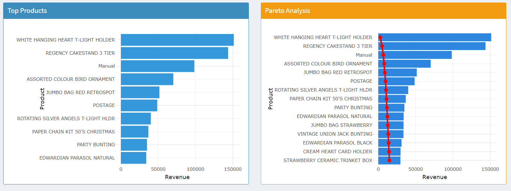

# Business Intelligence Dashboard with R Shiny

## Overview

This project presents an interactive Business Intelligence dashboard developed using **R Shiny** to analyze retail sales and customer behavior.

The dashboard integrates data preprocessing, customer analytics, revenue analysis, forecasting, and business intelligence visualizations into a single interactive application.

---

## Features

- Interactive dashboard built with R Shiny
- Business KPI monitoring
- Revenue analysis
- Customer segmentation
- Customer Lifetime Value (CLV)
- RFM Analysis
- Sales forecasting
- Product performance analysis
- Pareto Analysis
- Data quality assessment

---

## Technologies

- R
- Shiny
- ggplot2
- dplyr
- tidyr
- plotly
- DT
- forecast

---

## Dashboard Overview



## Top Products



## Customer Analytics



## Top Customers



## Pareto Analysis



---

## Project Structure

```
app.R
global.R
server.R
ui.R

load_data.R
clean_data.R
data_quality.R
exploratory_analysis.R
feature_engineering.R

customer_insights.R
customer_lifetime_value.R
rfm_analysis.R
sales_forecasting.R
```

---

## Key Insights

- Customer segmentation using business metrics
- Customer Lifetime Value (CLV) analysis
- Revenue trends over time
- Best-selling products
- Country-level revenue analysis
- Pareto analysis for product contribution
- Interactive KPI monitoring

---

## Future Improvements

- Predictive customer churn
- Profitability analysis
- Interactive forecasting controls
- Automated reporting

---

